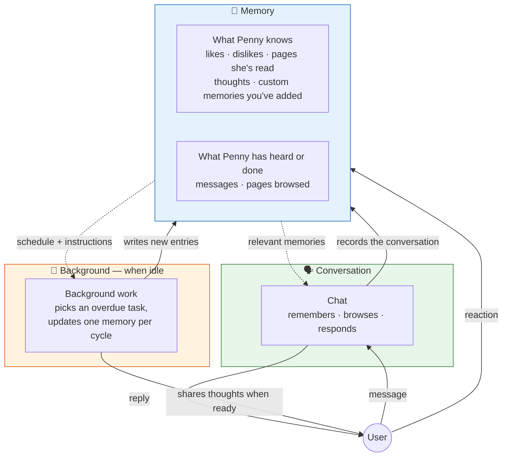

<p align="center">
  
</p>

# Penny
**Your private, personalized internet companion.**
<br>

**Author:** Jared Lockhart

[](https://github.com/lockhart-ai/penny/actions/workflows/check.yml)


<p align="center">
  
  
  
</p>

## Overview

Ask Penny anything and she'll search the web and text you back, always with sources.

But she's not just a question-answering bot. She pays attention. She remembers your conversations, learns what you're into, and starts sharing things she thinks you'd like on her own. She follows up on old topics when she finds something new. She gets to know you over time and her responses get more personal because of it.

Penny communicates via Signal, Discord, iOS, or a Firefox browser extension — all channels share the same conversation history. The browser extension gives her direct access to the web: she can browse pages with the full rendering engine and your session, see what you're currently looking at, and present her discoveries as a browsable feed of thought cards.

Penny is a feed only for you. Private, personal, and local.

## How It Works

### Conversations

When you send Penny a message, she always searches the web before responding — she never makes things up from model knowledge. A local LLM reads the search results and writes a response in her own voice: casual, calm, with sources. Penny uses the OpenAI Python SDK against any OpenAI-compatible endpoint, so you can run her against [Ollama](https://ollama.com), [omlx](https://github.com/madroidmaq/omlx), the OpenAI cloud, vLLM, or anything else that speaks the protocol.

Penny talks to you over [Signal](https://signal.org), [Discord](https://discord.com), an iOS client, or a [Firefox sidebar extension](docs/browser-extension-architecture.md) — the same apps you already use. All channels share conversation history: ask on Signal, follow up in the browser. Quote-reply to continue a thread; she'll walk the conversation history for context.

### Preferences

Penny builds a picture of what you care about. As you chat, she notices the things you bring up with interest or frustration — coffee preferences, weather complaints, hobbies you keep returning to — and files them away as likes and dislikes. A topic has to come up more than once before she takes it seriously, so an offhand comment doesn't send her down a rabbit hole.

You can also just tell her in plain language — "I'm really into dark roast coffee", "I can't stand cold weather", "forget about that one", or "what do you think I'm into?". She files these onto her likes and dislikes memory the same way, no commands to remember. These shape what she thinks about and what she shares with you.

### Thinking

When Penny isn't talking to you, she thinks. She picks something you're into, searches the web, and reasons through what she finds — keeping the result as a thought she can come back to. Thoughts feed into future conversations, so when you ask her about something she's been chewing on, the context is already there.

When she finds something genuinely interesting — not a repeat of what she's shared before, and aligned with what you actually like — she sends it to you on her own. She paces herself so you don't get overwhelmed.

### Memory

Penny remembers things in a few different shapes — your conversations, the pages she's read, what she's learned about you, the thoughts she's had on her own. When you ask her something, she pulls the most relevant pieces of all of that into context: a page she summarized last week, a topic you mentioned a few days ago, a thought she had this morning. Old material doesn't crowd out the new — only what's actually relevant comes along.

She can also remember things you ask her to. Tell her to keep track of restaurants you've been to, or articles to read later, and she'll start a new memory for it on the spot — no configuration, no code change.


### Commands

Beyond regular conversation, Penny supports slash commands:

- **/commands** — list every command available in this deployment
- **/profile** — set your name, location, and timezone (required before chat)
- **/config** — view or tune runtime parameters (30+ values: scheduling intervals, notification backoff, dedup thresholds, email pagination limits, etc.)
- **/mute**, **/unmute** — silence or resume autonomous notifications
Email is no longer a slash command — ask about your inbox in plain language ("did I get an email from …?", "check my email for …") and Penny drives the email tools (`search_emails`, `read_emails`, plus `list_emails`/`list_folders`/`draft_email` on Zoho). The tools are present only when a mailbox is configured — Fastmail via `FASTMAIL_API_TOKEN`, or Zoho via `ZOHO_API_ID`/`ZOHO_API_SECRET`/`ZOHO_REFRESH_TOKEN`.

## Penny's Mind

How information flows through Penny's cognitive systems — from perception to memory to thought to action.



### The Cognitive Cycle

1. **Conversation** — you send a message; Penny pulls the relevant pieces of memory into context (a related page, a recent thought, your preferences), browses the web if she needs to, and responds with sources
2. **Background work** — when she's idle, Penny works through her to-do list: picking up new preferences from your messages, summarizing pages she's read, generating thoughts on topics you're into, choosing which thoughts are worth sharing. Each task has its own pace
3. **Repeat** — outgoing messages, browses, and reactions all become memories that future background work can build on

### Models

Penny uses up to four LLM model roles, all running locally by default:

| Role | Env | Purpose | Required? |
|---|---|---|---|
| **Text** | `LLM_MODEL` | Single model for all of Penny's reasoning — chat, background work, scheduled tasks | Yes |
| **Embedding** | `LLM_EMBEDDING_MODEL` | Embeddings for knowledge retrieval, message similarity, and preference dedup | Yes |
| **Vision** | `LLM_VISION_MODEL` | Image captioning when users send photos | Optional |
| **Image** | `LLM_IMAGE_MODEL` | Image generation (ask Penny to draw — the `generate_image` tool) | Optional |

Text, vision, and embedding all go through the OpenAI SDK and can each point at a different OpenAI-compatible endpoint via the corresponding `LLM_*_API_URL` / `LLM_*_API_KEY` overrides — useful when running text on one machine and embeddings on another. Image generation is the one exception: it talks to Ollama's `/api/generate` endpoint directly (set `LLM_IMAGE_API_URL`), because there's no OpenAI-compatible image generation protocol that works with local models.

### Scheduling

Two background tracks run when Penny is idle (default: 60s after the last message): scheduled tasks you've created and Penny's own background work — extracting preferences, summarizing pages, thinking, choosing what to share. Each piece of background work has its own cadence; Penny picks the most-overdue ready task per tick, and skips the tick entirely if nothing is due. A foreground message cancels any in-progress background task immediately so the LLM is free to respond.

Recurring tasks — just ask in chat ("every morning send me a weather briefing") and Penny sets one up — run on their own timer regardless of idle state, so a daily weather briefing won't be blocked by an active conversation.

### Runtime Configuration

30+ parameters are tunable at runtime via `/config` — scheduling intervals, notification backoff, preference dedup thresholds, inner monologue settings, email pagination limits, and more. Values follow a three-tier lookup: database override → environment variable → default. Changes take effect immediately without restart.

## Browser Extension

The Firefox extension adds a visual, interactive layer on top of Penny's existing architecture:

- **Sidebar chat** — same conversation as Signal/Discord, with HTML-formatted responses, images, clickable links, and live in-flight tool status (e.g., "Searching…", "Reading example.com…")
- **Active tab context** — Penny can see the page you're currently viewing (via [Defuddle](https://github.com/kepano/defuddle) content extraction). Toggle "Include page content" to ask questions about any page
- **Browser tools** — `browse_url` opens pages in hidden tabs with the full web engine and your session. Per-addon "tool use" toggle controls whether each browser participates in tool dispatch
- **Domain permissions** — first-time access to a new domain triggers an approve/deny prompt. Approvals persist server-side and sync across all connected addons; prompts can also be answered from Signal so you don't need a browser open. `/config DOMAIN_PERMISSION_MODE allow_all` skips prompting entirely
- **Memory Explorer** — every memory in one place: a list view with entry counts and last-updated timestamps, plus a drill-in view where you can edit how each memory works (description, what it should remember, how often) and add, edit, or delete individual entries. Each memory's detail page also shows a recent history of background work so you can see exactly what Penny has been doing
- **Schedule manager** — UI for creating, editing, and deleting recurring cron tasks without touching the chat
- **Settings panel** — domain allowlist, runtime config params (the same 30+ values `/config` exposes), and addon-level toggles
- **Prompt log viewer** — every LLM call Penny makes, browseable from the extension: input prompt, response, internal reasoning, and (for background work) which memory the result was written to and why. Useful for understanding "why did Penny say that"
- **Multi-device** — each browser registers as a device (e.g., "firefox macbook 16"). All devices share the same user identity and conversation history. In-flight progress reactions on Signal also surface on the user's message via emoji morphing (💭 → 🔍 → 📖 → cleared on completion)

```bash
cd browser
npm install
npm run dev    # Build, watch, and launch Firefox with auto-reload
```

See [docs/browser-extension-architecture.md](docs/browser-extension-architecture.md) for the full architecture and security model.

## iOS Channel

The iOS channel is a foreground WebSocket plus APNs preview-notification path:

- **Foreground app** — the iOS app connects to Penny's WebSocket, registers its device/APNs token, sends chat messages, and pulls queued outbox rows. When Penny has a new message while the socket is connected, she sends an `outbox_changed` hint and the app pulls messages.
- **Background/offline app** — Penny still writes every outgoing message to the durable iOS outbox. If the device is not connected, Penny sends an APNs alert containing a short summary and source hint, such as `Notifier`, `Chat`, or `Collector: flight-deals`.
- **Reconnect** — the app sends `pull_messages`, displays/persists the returned rows, then sends `ack_messages` so Penny can mark them delivered.

Device registration is gated by `IOS_PAIRING_TOKEN` when configured. The client sends a `register` WebSocket message with `device_id`, `label`, `pairing_token`, optional `device_secret`, `apns_token`, `apns_environment`, and `app_version`. When Penny is running with `CHANNEL_TYPE=ios`, the registered iOS device becomes the default channel target. When `IOS_ENABLED=true` is used alongside Signal, iOS runs in parallel while Signal remains the default target until the default device is changed.

For APNs setup, create an Apple Push Notifications authentication key in the Apple Developer portal. `IOS_APNS_KEY_ID` is the Key ID shown for that key, and `IOS_APNS_KEY_PATH` should point at the downloaded `.p8` file inside the container. The repo mounts `./data` at `/penny/data`, so a common setup is to put the key under `data/private/AuthKey_XXXX.p8` and set `IOS_APNS_KEY_PATH="/penny/data/private/AuthKey_XXXX.p8"`. `.p8` files are ignored by git.

Diagnostic phrase: send `send me a test push` from the iOS app to force a test APNs notification to that registered device, even while the WebSocket is connected. Similar phrases such as `test push` and `send a test notification` work too.

### iOS Service Diagram

<p align="center">
  
</p>

Example service diagram for an iOS setup, using Openrouter as a model host and a Digital Ocean droplet running Nginx as a proxy. 

## Setup & Running

### Prerequisites

1. **For Signal**: [signal-cli-rest-api](https://github.com/bbernhard/signal-cli-rest-api) running on host (port 8080)
2. **For Discord**: Discord bot token and channel ID
3. **For iOS**: an iOS client that speaks the Penny WebSocket protocol; APNs credentials if you want background notifications
4. **An OpenAI-compatible LLM endpoint** running on host or reachable from the container. Set `LLM_API_URL` to point at it. Common choices: [Ollama](https://ollama.com), [omlx](https://github.com/madroidmaq/omlx), [vLLM](https://github.com/vllm-project/vllm), the OpenAI cloud
5. **Browser extension** loaded in Firefox (for web search, page reading, and the visual UI)
6. Docker & Docker Compose installed

### Quick Start

```bash
# 1. Create .env file with your configuration
cp .env.example .env
# Edit .env with your settings (Signal or Discord credentials)

# 2. Start the agent
make up
```

### Make Commands

```bash
make up               # Build and start all services (foreground)
make prod             # Deploy penny only (no team, no override)
make prod-ios         # Run Penny as the iOS channel without starting signal-api
make kill             # Tear down containers and remove local images
make build            # Build the penny Docker image
make team-build       # Build the penny-team Docker image
make browser-build    # Bundle the browser extension content script
make check            # Format check, lint, typecheck, migrate-validate, pytest (penny + team), tsc (browser)
make pytest           # Run integration tests (penny + team)
make fix              # Format + autofix lint issues (penny + team)
make typecheck        # Type check with ty (penny + team)
make token            # Generate GitHub App installation token for gh CLI
make signal-avatar    # Set Penny's Signal profile picture
make migrate-test     # Test database migrations against a copy of prod DB
make migrate-validate # Check for duplicate migration number prefixes
make client-check     # Build the iOS client + run its tests on a simulator (requires Xcode)
```

All dev tool commands run in temporary Docker containers via `docker compose run --rm`, with source volume-mounted so changes write back to the host filesystem.

<details>
<summary><h2>Configuration</h2></summary>

Configuration is managed via a `.env` file in the project root:

```bash
# .env

# Channel type (optional — auto-detected from credentials)
# CHANNEL_TYPE="signal"  # "signal", "discord", or "ios"

# Signal Configuration (required for Signal)
SIGNAL_NUMBER="+1234567890"
SIGNAL_API_URL="http://localhost:8080"

# Discord Configuration (required for Discord)
DISCORD_BOT_TOKEN="your-bot-token"
DISCORD_CHANNEL_ID="your-channel-id"

# Browser Extension (optional)
BROWSER_ENABLED=true
BROWSER_HOST="0.0.0.0"                    # Use 0.0.0.0 in Docker
BROWSER_PORT=9090

# iOS Channel (optional)
IOS_ENABLED=false
IOS_HOST="0.0.0.0"                        # Use 0.0.0.0 in Docker
IOS_PORT=9091
IOS_PAIRING_TOKEN=""                      # Required by server if set; client sends it in register
IOS_APNS_TEAM_ID=""                       # Apple Developer Team ID
IOS_APNS_KEY_ID=""                        # APNs auth key ID
IOS_APNS_KEY_PATH=""                      # Container path to .p8, e.g. /penny/data/private/AuthKey_XXXX.p8
IOS_BUNDLE_ID=""                          # iOS app bundle id, e.g. com.example.Penny
IOS_APNS_SANDBOX=true                     # Fallback only: devices report sandbox/production at registration

# LLM Configuration — any OpenAI-compatible endpoint (Ollama, omlx, vLLM,
# OpenAI cloud, ...). The example URL points at a local Ollama instance.
LLM_API_URL="http://host.docker.internal:11434/v1"
LLM_MODEL="gpt-oss:20b"                   # Single model for all agents
# LLM_API_KEY="not-needed"                # Default fine for unauthenticated local backends
# LLM_VISION_MODEL="qwen3-vl"             # Optional, enables vision/image messages
LLM_EMBEDDING_MODEL="embeddinggemma"      # Required — backs memory (preference dedup + similarity recall)
# LLM_IMAGE_MODEL="x/z-image-turbo"       # Optional, enables the generate_image tool (uses LLM_IMAGE_API_URL)
# LLM_IMAGE_API_URL="http://host.docker.internal:11434"  # Ollama REST for image generation

# Database & Logging
DB_PATH="/penny/data/penny/penny.db"
LOG_LEVEL="INFO"
# LOG_FILE="/penny/data/penny/logs/penny.log"

# Fastmail JMAP (optional, enables the email tools on the chat surface)
# FASTMAIL_API_TOKEN="your-api-token"

# Zoho Mail (optional, enables the email tools on the chat surface, Zoho backend)
# ZOHO_API_ID="..."
# ZOHO_API_SECRET="..."
# ZOHO_REFRESH_TOKEN="..."

# GitHub App (optional, enables agent containers)
# GITHUB_APP_ID="12345"
# GITHUB_APP_PRIVATE_KEY_PATH="data/private/github-app.pem"
# GITHUB_APP_INSTALLATION_ID="67890"

# Penny-team agent containers (optional, leave blank to disable)
# CLAUDE_CODE_OAUTH_TOKEN="..."           # From `claude setup-token` (Max plan)
# OLLAMA_BACKGROUND_MODEL="..."           # Optional, enables team Quality agent
```

### Channel Selection

Penny auto-detects which channel to use based on configured credentials:
- If `DISCORD_BOT_TOKEN` and `DISCORD_CHANNEL_ID` are set (and Signal is not), uses Discord
- If `SIGNAL_NUMBER` is set, uses Signal
- If `IOS_ENABLED=true` is set with Signal, the iOS WebSocket/APNs channel starts in parallel and Signal remains the primary/default channel
- If only `IOS_ENABLED=true` is set, uses iOS
- Set `CHANNEL_TYPE` explicitly to override auto-detection. Use `CHANNEL_TYPE=ios` to make iOS the primary/default channel without starting Signal.
- Use `make prod-ios` to run Penny with `CHANNEL_TYPE=ios` without starting the Signal container.

### Configuration Reference

**LLM** — Penny talks to any OpenAI-compatible endpoint via the OpenAI Python SDK. There are no Ollama-specific dependencies in the runtime.
- `LLM_API_URL`: API endpoint (default: `http://host.docker.internal:11434`)
- `LLM_MODEL`: Single text model for all agents (default: `gpt-oss:20b`)
- `LLM_API_KEY`: API key (default: `"not-needed"`, fine for unauthenticated local backends)
- `LLM_VISION_MODEL`: Vision model for image understanding (e.g., `qwen3-vl`). Optional; enables image messages
- `LLM_VISION_API_URL` / `LLM_VISION_API_KEY`: Override API URL/key for the vision model (e.g., to run vision on a different host)
- `LLM_EMBEDDING_MODEL`: **Required.** Dedicated embedding model (e.g., `embeddinggemma`) that backs preference/knowledge/message embeddings — Penny fails fast at startup if it is unset
- `LLM_EMBEDDING_API_URL` / `LLM_EMBEDDING_API_KEY`: Override API URL/key for the embedding model
- `LLM_IMAGE_MODEL`: Image generation model (e.g., `x/z-image-turbo`). Optional; enables the `generate_image` chat tool (ask Penny to draw). Image generation is the one non-OpenAI endpoint — it talks to Ollama's `/api/generate` directly
- `LLM_IMAGE_API_URL`: Ollama REST endpoint for image generation (default: `http://host.docker.internal:11434`)

**API Keys:**
- `FASTMAIL_API_TOKEN`: enables the email tools on the chat surface (Fastmail)
- `ZOHO_API_ID`, `ZOHO_API_SECRET`, `ZOHO_REFRESH_TOKEN`: enables the email tools on the chat surface (Zoho backend; obtain via Zoho's OAuth flow)

**GitHub App** (required for agent containers):
- `GITHUB_APP_ID`, `GITHUB_APP_PRIVATE_KEY_PATH`, `GITHUB_APP_INSTALLATION_ID`

**Browser Extension** (optional):
- `BROWSER_ENABLED`: `true` to start the WebSocket server (default: false)
- `BROWSER_HOST`: bind address (default: `localhost`; use `0.0.0.0` in Docker)
- `BROWSER_PORT`: WebSocket port (default: `9090`)

**iOS Channel** (optional):
- `IOS_ENABLED`: `true` to enable the iOS channel alongside the auto-detected primary channel; with Signal configured, both Signal and iOS listen in parallel
- `IOS_HOST`: WebSocket bind address (default: `0.0.0.0`, the Docker default; use `localhost` for host-only binding)
- `IOS_PORT`: WebSocket port (default: `9091`)
- `IOS_PAIRING_TOKEN`: optional shared token required during device registration when set
- `IOS_APNS_TEAM_ID`: Apple Developer Team ID
- `IOS_APNS_KEY_ID`: APNs auth key ID from the Apple Developer portal
- `IOS_APNS_KEY_PATH`: container path to the APNs `.p8` auth key
- `IOS_BUNDLE_ID`: iOS app bundle identifier used as the APNs topic
- `IOS_APNS_SANDBOX`: fallback APNs environment (`true` = sandbox) for devices that did not report a recognized `apns_environment` at registration; the per-device value wins otherwise

**Behavior:**
- `TOOL_TIMEOUT`: Tool execution timeout in seconds (default: 120)
- `MESSAGE_MAX_STEPS` / `IDLE_SECONDS`: also accepted as env vars, but these are runtime-configurable via `/config` so DB overrides win
- 30+ parameters are runtime-configurable via `/config` — scheduling intervals, notification cooldowns/candidates, preference dedup thresholds, history context limits, email body/search/list pagination limits, related-message retrieval thresholds, and more

**Logging:**
- `LOG_LEVEL`: DEBUG, INFO, WARNING, ERROR (default: INFO)
- `LOG_FILE`: Optional path to log file
- `LOG_MAX_BYTES`: Maximum log file size before rotation (default: 10 MB)
- `LOG_BACKUP_COUNT`: Number of rotated backup files to keep (default: 5)
- `DB_PATH`: SQLite database location (default: `/penny/data/penny/penny.db`)

</details>

<details>
<summary><h2>Discord Setup</h2></summary>

1. Create a Discord application at https://discord.com/developers/applications
2. Create a bot for the application and copy the token
3. Enable these intents in the Bot settings under **Privileged Gateway Intents**:
   - **Message Content Intent** — **required**. Without it Discord refuses the gateway
     connection and Penny exits at startup with an actionable log line pointing you here.
   - Server Members Intent (optional)
4. Invite the bot to your server with the OAuth2 URL Generator:
   - Scopes: `bot`
   - Permissions: `Send Messages`, `Read Message History`
5. Get the channel ID (enable Developer Mode in Discord settings, right-click channel → Copy ID)
6. Add to your `.env`:
   ```bash
   DISCORD_BOT_TOKEN="your-token"
   DISCORD_CHANNEL_ID="your-channel-id"
   ```

</details>

<details>
<summary><h2>Testing & CI</h2></summary>

Penny includes end-to-end integration tests that mock all external services:

```bash
make pytest      # Run all tests
make check       # Run format, lint, typecheck, and tests
```

CI runs `make check` in Docker on every push to `main` and on pull requests via GitHub Actions. Pull requests touching `penny-client/` also run `make client-check` on a macOS runner, building the iOS app and running its test suite on a simulator.

Tests cover the full message flow (search, response, threading, typing indicators), all background agents (history, thinking, notify, scheduler coordination), every slash command, vision processing, and tool edge cases. External services are replaced with mock servers and SDK patches — a mock Signal WebSocket server and a mock LLM client (`MockLlmClient`, patches `openai.AsyncOpenAI`) with configurable responses.

</details>

<details>
<summary><h2>Agent Orchestrator</h2></summary>

Penny includes a Python-based agent orchestrator that manages autonomous Claude CLI agents. Agents process work from GitHub Issues on a schedule, using labels as a state machine:

```
backlog → requirements → specification → in-progress → in-review → closed   (features)
bug → in-review → closed                                                     (bug fixes)
```

**Agents:**
- **Product Manager**: Gathers requirements for `requirements` issues
- **Architect**: Writes detailed specs for `specification` issues, handles spec feedback
- **Worker**: Implements `in-progress` issues — creates branches, writes code/tests, runs `make check`, opens PRs; addresses PR feedback on `in-review` issues; fixes `bug` issues directly
- **Monitor**: Watches production logs for errors, deduplicates against existing issues, and files `bug` issues automatically
- **Quality**: Evaluates Penny's response quality via a local LLM, files `bug` issues for low-quality output (optional, requires `OLLAMA_BACKGROUND_MODEL`)

Each agent checks for matching GitHub issue labels before waking Claude CLI, so idle cycles cost ~1 second instead of a full Claude invocation.

```bash
make up          # Run orchestrator with full stack
```

</details>

## License

MIT
